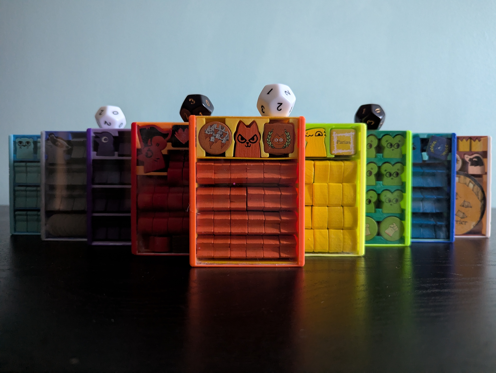
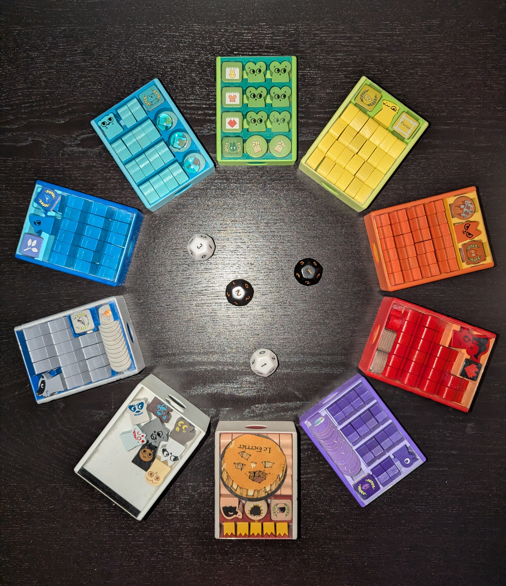
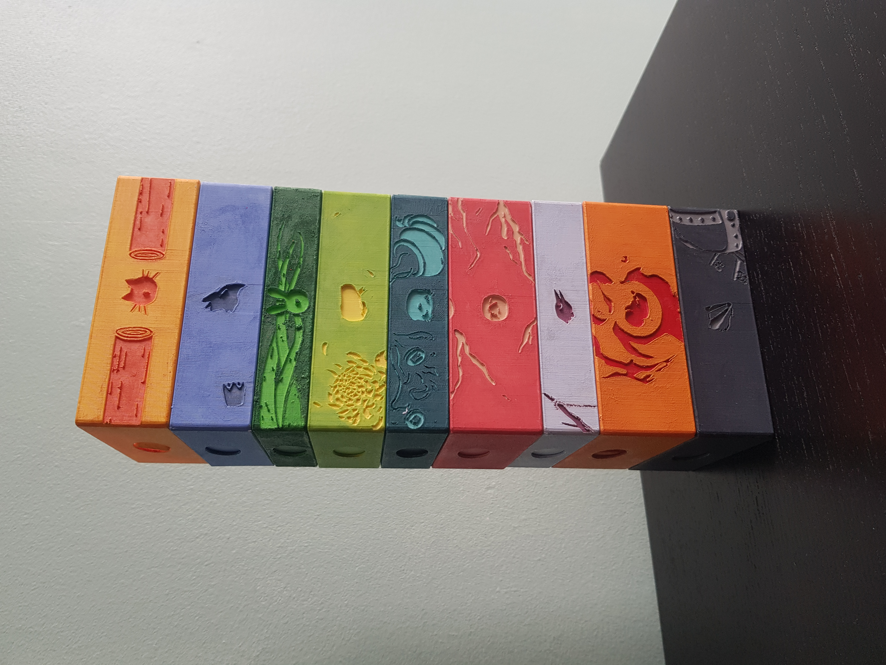
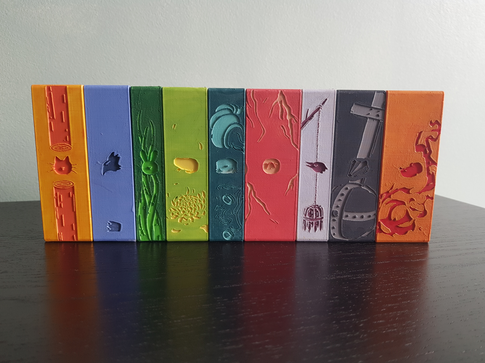

# Inserts for the board game Root, made by Leder Games.

## Description

Stl files of individual custom-made inserts and containers for the base and expansions content of the board game Root:
- Marquise de Cat
- Eyrie Dynasties
- Woodland Alliance
- Vagabond - UPLOAD OF THE MEEPLE DRAWER IN AUTUMN
- Second Vagabond
- Lizard Cult
- Riverfolk Company
- Underground Duchy
- Corvid Conspiracy
- Lord of the Hundreds
- Keepers in Iron
- Twilight Council - UPLOAD IN AUTUMN
- Lilypad Diaspora - UPLOAD IN AUTUMN
- Knaves of the Deepwood - UPLOAD IN AUTUMN

as well as
- The three decks
- Setup pieces
- Monuments 1 - UPLOAD SOON
- Monuments 2 - UPLOAD IN AUTUMN

The inserts are drawers which slide in the containers, forming a "box". All faction pieces, including cards, fit in their respective boxes.  
Compatible with official sleeves, or common unofficial sleeves of similar size.  
Horizontal or Vertical storage. In fact, all directions are possible.  
Can be used with any version of the board game: English, French, etc. Containers' positions are interchangeable.

## Presentation

 
 
 
 
 
 
 
 
 

 ## Glimpse

Examples of 3D models:
 
 - 

 ## How to craft

Print the drawers with a 0.4mm nozzle, and the containers with a 0.2mm nozzle.  
Cut pieces of 67mm x 91.75mm out of 1.2mm thick acrylic sheets. Glue the pieces inside the containers.

 ## Box Organisation

 Storage solutions for the American box once the Homeland expansion is released: 

  or
  or anything you want

Temporary storage solution for the French Marauder box:
- Similar to the American box, but slightly larger.
- Need to raise the lid if all the faction and clockwork boards are in.

 
 
 
 
 
 
 

Temporary storage solution for the French big box:
- No need to raise the lid

 
 
 
 
 
 

## Process

Made using Blender, Krita, Inscape, Bambu Studio, and the free online repair tool https://www.formware.co/onlinestlrepair.

## Future Improvements

Box for resign clearing markers.

Better Clockwork cards Holders.

One or two containers for the Setup pieces and Monuments.

Container alternatives without plexiglass.

Vagabond box for 9 meeples and for 2 meeples.

Hirelings inserts for the Hireling box, maybe, one day...

## Gallery

Proof that containers do contain the faction cards and Corvids highlighting:

 
 

Alternative printing with color inversion:

 
 

## Acknoledgements

Thanks to Paul and Suzanne for their help and support

## LICENSE

This is not an official product of Leder Games.  
Root Inserts © 2025 by Romain Chaussonnier is licensed under CC BY-NC-SA 4.0 

