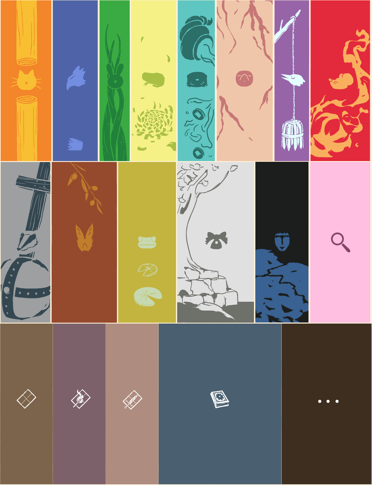
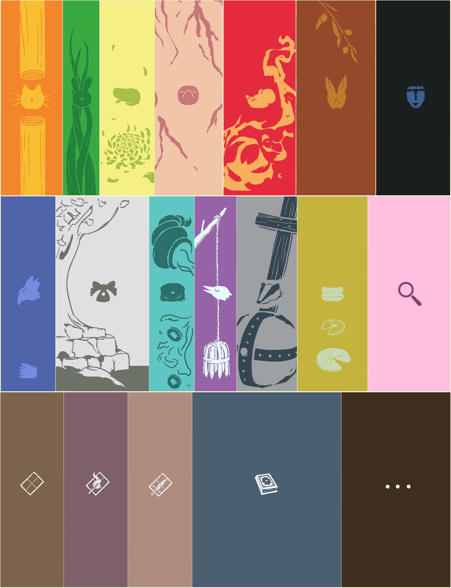

# Inserts for the board game "Root", made by Leder Games.

## Description

Stl files of individual custom-made inserts and containers for the base and expansions content of the board game Root:
- Marquise de Cat
- Eyrie Dynasties
- Woodland Alliance
- Vagabond - UPLOAD OF THE MEEPLE DRAWER IN AUTUMN
- Second Vagabond
- Lizard Cult
- Riverfolk Company
- Underground Duchy
- Corvid Conspiracy
- Lord of the Hundreds
- Keepers in Iron
- Twilight Council - UPLOAD IN AUTUMN
- Lilypad Diaspora - UPLOAD IN AUTUMN
- Knaves of the Deepwood - UPLOAD IN AUTUMN

as well as
- The three decks
- Setup pieces
- Monuments 1 - UPLOAD SOON
- Monuments 2 - UPLOAD IN AUTUMN

The inserts are drawers which slide in the containers. All faction pieces, including cards, fit in their respective containers. Sleeve compatible. Containers' positions are interchangeable.

 
 
 
 
 
 
 
 
 

 ## How to craft

Print the drawers with a 0.4mm nozzle, and the containers with a 0.2mm nozzle.

Cut pieces of 67mm x 91.75mm out of a 1.2mm thick acrylic sheets. Glue the pieces inside the containers.

 ## Box Organisation

  or
  or anything you want

 ## Glimpse
 
 - 

## Process

Made using Blender, Krita, Inscape, Bambu Studio, and the free online repair tool https://www.formware.co/onlinestlrepair.

## Future Improvements

Box for resign clearing markers.

Better Clockwork cards Holders.

One or two containers for the Setup pieces and Monuments.

Container alternatives without plexiglass.

Vagabond box for 9 meeples and for 2 meeples.

Hirelings inserts for the Hireling box, maybe, one day...

## GALLERY

## LICENSE
 
Root Inserts © 2025 by Romain Chaussonnier is licensed under CC BY-NC-SA 4.0 

